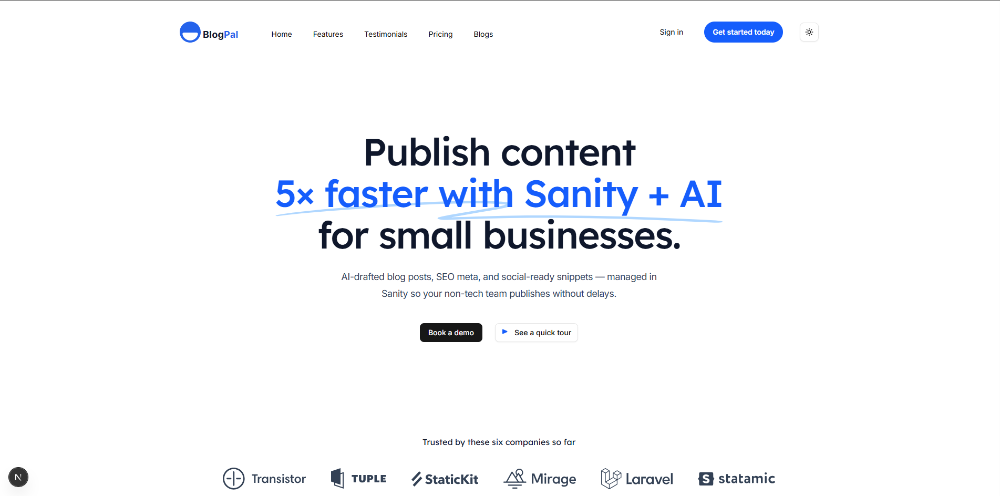

# AI Content Hub — Next.js + Sanity

### A starter Next.js project that uses Sanity as the content backend for a SaaS marketing site + blog (landing page + blog listing + single-post pages).

### This README helps you get the project running, shows how the landing page and blog display are wired to Sanity, and lists useful queries, env vars, and deployment tips.

## 

### Table of contents

1. Project overview
2. Features
3. Tech stack
4. Quick start
5. Next.js app — key files & patterns
   - lib/sanityClient.js
   - Landing page: pages/index.js / app/page
   - Blog list: pages/blogs/index.js
   - Single post: pages/blogs/[slug].js

## 1. Project overview

AI Content Hub is a simple SaaS marketing site pattern:

A Landing page (editable in Sanity) — hero, features, testimonials, pricing, CTA.

A Blog (list + single posts) — content stored and edited in Sanity Studio, rendered in Next.js.

Optional: Admin flow to create/edit posts from your app (server-side API with Sanity write token).

Optional: AI features (OpenAI) to generate drafts, SEO, social captions, stored as Sanity drafts.

This repo focuses on wiring up Sanity → Next.js so content editors can update content in Studio and have the site reflect changes.

Features

Landing page managed from Sanity (landingPage doc)

Blog list page (paginated or all posts) fetched from Sanity via GROQ

Single post pages rendering Portable Text (Sanity rich content)

Image builder via @sanity/image-url for responsive images

Static generation with ISR (recommended) for fast pages + fresh content

Admin-friendly: preview/drafts and a path to add-create posts from the app via server API

## 2. Tech stack

Next.js (Pages or App Router)

Sanity v3 (Studio + dataset)

@sanity/client, @sanity/image-url, @portabletext/react

TailwindCSS (UI / TailwindUI ready)

(Optional) NextAuth / Auth provider for admin protection

(Optional) OpenAI for AI content generation

Prerequisites

Node.js 18+ / npm or yarn

Sanity CLI (npm install -g @sanity/cli)

A Sanity project (you can create one when running sanity init)

Vercel account (recommended for deployment)

## 3. Quick start

### Clone the repo:

- git clone <repo-url>
- cd ai-content-hub

### Install dependencies:

- npm install
- Setup Sanity Studio (see next section). Add schemas and seed content.

- Run Next.js : npm run dev

### Run Sanity Studio:

    - cd sanity
    - npm install
    - sanity start
